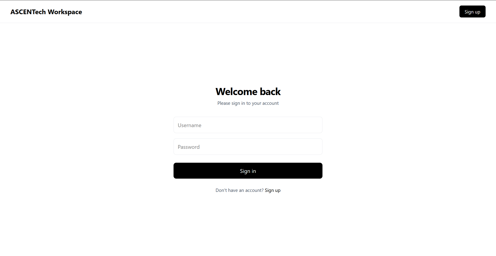
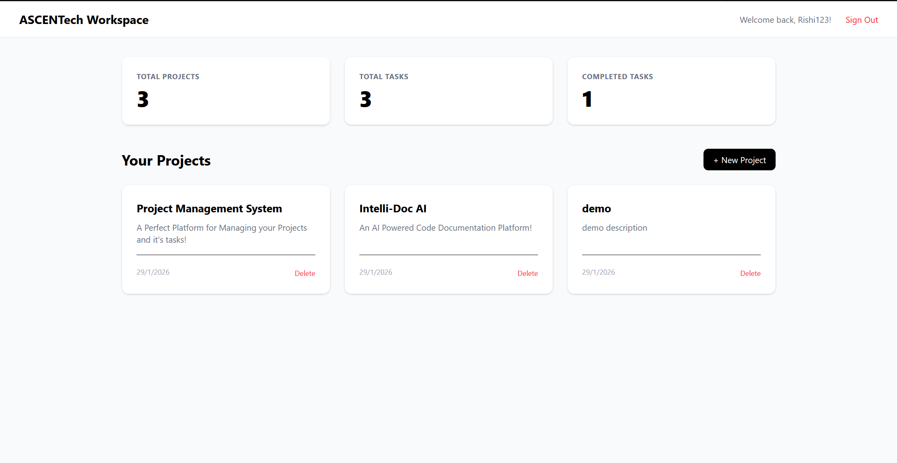
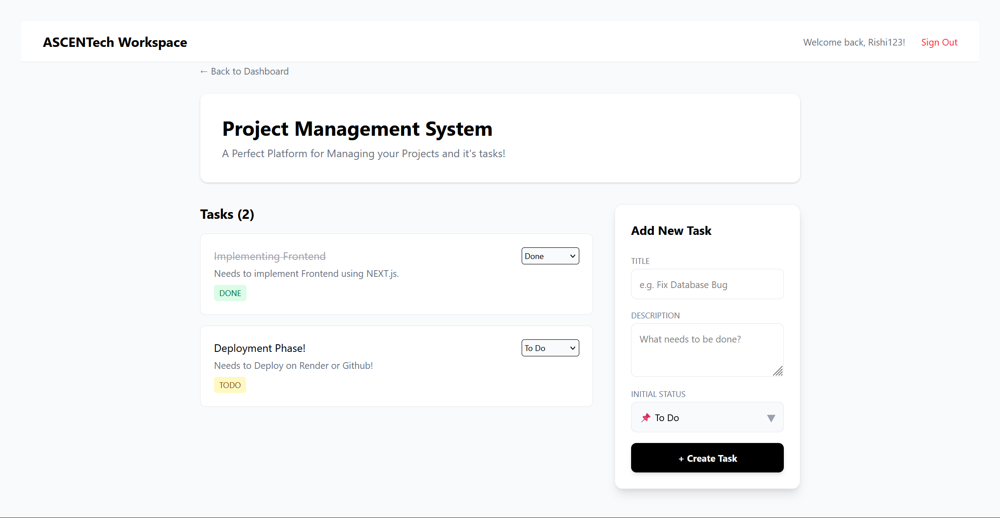

# 🚀 ASCENTech Workspace

A full-stack **Project & Task Management Application** built as an assignment for ASCENTech. This application allows users to register, login, create projects, and manage tasks with status tracking — all with a modern, responsive UI.

---

## 📋 Table of Contents

- [Features](#-features)
- [Tech Stack](#-tech-stack)
- [Project Structure](#-project-structure)
- [Getting Started](#-getting-started)
  - [Prerequisites](#prerequisites)
  - [Backend Setup](#backend-setup)
  - [Frontend Setup](#frontend-setup)
- [API Endpoints](#-api-endpoints)
- [Screenshots](#-screenshots)
- [License](#-license)

---

## ✨ Features

### 🔐 Authentication
- User Registration with username, email, and password
- JWT-based Login Authentication
- Secure token storage in cookies
- Protected routes and API endpoints

### 📁 Project Management
- Create new projects with name and description
- View all projects owned by the logged-in user
- Delete projects (cascades to all related tasks)
- Project detail page with task list

### ✅ Task Management
- Create tasks within projects
- Task status tracking: **TODO** → **IN_PROGRESS** → **DONE**
- Update task status via dropdown
- Delete individual tasks

### 📊 Dashboard
- Summary statistics display:
  - Total Projects
  - Total Tasks
  - Completed Tasks
- Quick project overview cards
- Responsive grid layout

---

## 🛠 Tech Stack

### Frontend
| Technology | Version | Purpose |
|------------|---------|---------|
| **Next.js** | 16.1.6 | React framework with App Router |
| **React** | 19.2.3 | UI library |
| **TypeScript** | 5.x | Type-safe JavaScript |
| **Tailwind CSS** | 4.x | Utility-first CSS framework |
| **Axios** | 1.13.4 | HTTP client for API calls |
| **js-cookie** | 3.0.5 | Cookie management for JWT tokens |

### Backend
| Technology | Version | Purpose |
|------------|---------|---------|
| **Django** | 5.2.10 | Python web framework |
| **Django REST Framework** | - | RESTful API development |
| **Simple JWT** | - | JWT authentication |
| **SQLite** | - | Database (development) |
| **django-cors-headers** | - | CORS handling |

---

## 📂 Project Structure

```
ASCENTech_Assignment/
├── frontend/                    # Next.js Frontend Application
│   ├── app/                     # App Router pages
│   │   ├── dashboard/           # Dashboard page
│   │   │   └── page.tsx
│   │   ├── login/               # Login page
│   │   │   └── page.tsx
│   │   ├── register/            # Registration page
│   │   │   └── page.tsx
│   │   ├── projects/
│   │   │   └── [id]/            # Dynamic project detail page
│   │   │       └── page.tsx
│   │   ├── layout.tsx           # Root layout
│   │   ├── page.tsx             # Home page
│   │   └── globals.css          # Global styles
│   ├── components/              # Reusable UI components
│   │   ├── AuthNavbar.tsx       # Navigation bar for auth pages
│   │   ├── Navbar.tsx           # Main navigation bar (dashboard)
│   │   └── StatCard.tsx         # Statistics card component
│   ├── services/                # API service functions
│   │   ├── auth.ts              # Authentication services
│   │   ├── projects.ts          # Project CRUD services
│   │   └── tasks.ts             # Task CRUD services
│   ├── utils/
│   │   └── api.ts               # Axios instance configuration
│   └── package.json
│
├── backend(R)/                  # Django Backend Application
│   ├── backend/                 # Django project settings
│   │   ├── settings.py          # Project configuration
│   │   ├── urls.py              # Root URL routing
│   │   ├── wsgi.py
│   │   └── asgi.py
│   ├── users/                   # User authentication app
│   │   ├── models.py
│   │   ├── views.py             # Register view
│   │   ├── serializers.py       # User serializers
│   │   └── urls.py              # Auth endpoints
│   ├── projects/                # Projects app
│   │   ├── models.py            # Project model
│   │   ├── views.py             # ProjectViewSet
│   │   ├── serializers.py       # Project serializers
│   │   └── urls.py
│   ├── tasks/                   # Tasks app
│   │   ├── models.py            # Task model with status choices
│   │   ├── views.py             # TaskViewSet
│   │   ├── serializers.py       # Task serializers
│   │   └── urls.py
│   ├── db.sqlite3               # SQLite database
│   └── manage.py
│
└── venv/                        # Python virtual environment
```

---

## 🚀 Getting Started

### Prerequisites

Ensure you have the following installed:
- **Python** 3.10+
- **Node.js** 18+
- **npm** or **yarn**

### Backend Setup

1. **Navigate to the backend directory:**
   ```bash
   cd backend(R)
   ```

2. **Create and activate a virtual environment:**
   ```bash
   # Windows
   python -m venv ../venv
   ..\venv\Scripts\activate

   # macOS/Linux
   python3 -m venv ../venv
   source ../venv/bin/activate
   ```

3. **Install dependencies:**
   ```bash
   pip install django djangorestframework djangorestframework-simplejwt django-cors-headers
   ```

4. **Run database migrations:**
   ```bash
   python manage.py migrate
   ```

5. **Start the development server:**
   ```bash
   python manage.py runserver
   ```
   The backend will be available at `http://127.0.0.1:8000`

### Frontend Setup

1. **Navigate to the frontend directory:**
   ```bash
   cd frontend
   ```

2. **Install dependencies:**
   ```bash
   npm install
   ```

3. **Start the development server:**
   ```bash
   npm run dev
   ```
   The frontend will be available at `http://localhost:3000`

---

## 🌐 API Endpoints

### Authentication
| Method | Endpoint | Description |
|--------|----------|-------------|
| POST | `/api/users/register/` | Register a new user |
| POST | `/api/users/login/` | Login and get JWT tokens |
| POST | `/api/users/token/refresh/` | Refresh access token |

### Projects
| Method | Endpoint | Description |
|--------|----------|-------------|
| GET | `/api/projects/` | List all user's projects |
| POST | `/api/projects/` | Create a new project |
| GET | `/api/projects/{id}/` | Get project details with tasks |
| PUT | `/api/projects/{id}/` | Update a project |
| DELETE | `/api/projects/{id}/` | Delete a project |

### Tasks
| Method | Endpoint | Description |
|--------|----------|-------------|
| GET | `/api/tasks/` | List all user's tasks |
| POST | `/api/tasks/` | Create a new task |
| GET | `/api/tasks/{id}/` | Get task details |
| PATCH | `/api/tasks/{id}/` | Update task (e.g., status) |
| DELETE | `/api/tasks/{id}/` | Delete a task |

---

## 📸 Screenshots

> Screenshots of the application to showcase the UI.

### Login Page

*Clean, minimal login interface*

### Dashboard

*Overview of all projects with statistics*

### Project Details

*Task management with status updates*

---

## 🔒 Security Features

- **JWT Authentication**: Secure token-based authentication
- **Password Hashing**: Django's built-in password hashing
- **CORS Protection**: Configured CORS headers for frontend access
- **Owner-based Filtering**: Users can only access their own projects and tasks
- **Protected Endpoints**: All project and task endpoints require authentication

---

## 📝 Data Models

### User (Django's built-in)
- `id`, `username`, `email`, `password`

### Project
| Field | Type | Description |
|-------|------|-------------|
| `id` | AutoField | Primary key |
| `name` | CharField(100) | Project name |
| `description` | TextField | Project description |
| `owner` | ForeignKey(User) | Project owner |
| `created_at` | DateTimeField | Auto-set on creation |

### Task
| Field | Type | Description |
|-------|------|-------------|
| `id` | AutoField | Primary key |
| `title` | CharField(100) | Task title |
| `description` | TextField | Task description |
| `status` | CharField | TODO, IN_PROGRESS, or DONE |
| `project` | ForeignKey(Project) | Parent project |
| `created_at` | DateTimeField | Auto-set on creation |

---

## 📄 License

This project was created as an assignment for **ASCENTech**.

---

## 👤 Author

**Rishi Padala**

---

## 🙏 Acknowledgments

- [Next.js Documentation](https://nextjs.org/docs)
- [Django REST Framework](https://www.django-rest-framework.org/)
- [Tailwind CSS](https://tailwindcss.com/)
- [Simple JWT for Django](https://django-rest-framework-simplejwt.readthedocs.io/)
- [Gemini AI](https://gemini.google.com/)
- [Git](https://git-scm.com/)
